# CI/CD Blue-Green Deployment on ECS Fargate

> Terraform-based CI/CD pipeline deploying containerized apps to **Amazon ECS** with **Blue-Green deployments** via **AWS CodeDeploy**, **CodePipeline**, and **CodeBuild**. Built to eliminate downtime during production releases.

---

## The Story

After building a few infrastructure projects, I wanted to tackle the part every dev team actually cares about: shipping code without breaking production. Blue-Green deployments felt like the natural next step — route traffic to a new environment, verify it works, then cut over. If something breaks? Roll back in under a minute.

This pipeline automates the entire flow: push code to S3, let CodePipeline orchestrate the build and deployment, and watch CodeDeploy swap traffic between Blue and Green environments on ECS Fargate.

Of course, it wasn't all smooth sailing. I hit AWS account limits on CodeBuild that forced me to troubleshoot pipeline failures and find workarounds. More on that below — it's honestly where I learned the most.

---

## Architecture

```
┌─────────────┐     ┌──────────────┐     ┌───────────┐     ┌─────────┐     ┌─────────────┐
│   S3 Source  │────▶│ CodePipeline │────▶│ CodeBuild │────▶│   ECR   │────▶│ ECS Fargate │
│  (app.zip)   │     │  (Orchestrate)│    │  (Build)  │     │ (Image) │     │(Blue/Green) │
└─────────────┘     └──────────────┘     └───────────┘     └─────────┘     └──────┬──────┘
                                                                                    │
                                                                              ┌─────▼──────┐
                                                                              │ CodeDeploy │
                                                                              │(Switch    │
                                                                              │ Traffic)   │
                                                                              └─────┬──────┘
                                                                                    │
                                                                              ┌─────▼──────┐
                                                                              │    ALB     │
                                                                              │  (Routes   │
                                                                              │  Traffic)  │
                                                                              └────────────┘
```

**Pipeline Stages:**

| Stage | Service | What It Does |
|-------|---------|--------------|
| **Source** | S3 + CodePipeline | Detects new app uploads and triggers the pipeline |
| **Build** | CodeBuild | Builds Docker image from source, pushes to ECR |
| **Deploy** | CodeDeploy + ECS | Blue-Green deployment — launches Green tasks, health checks, then shifts ALB traffic |

---

## The Tech Stack

| Category | Tools |
|----------|-------|
| **Container Orchestration** | Amazon ECS Fargate |
| **CI/CD Pipeline** | AWS CodePipeline |
| **Build** | AWS CodeBuild |
| **Deployment Strategy** | AWS CodeDeploy (Blue/Green) |
| **Container Registry** | Amazon ECR |
| **Load Balancer** | Application Load Balancer |
| **Monitoring** | Amazon CloudWatch (Logs, Alarms, Dashboard) |
| **Networking** | VPC with 2 Public Subnets across 2 AZs |
| **IAM** | 4 dedicated roles (pipeline, codebuild, ecs-task, ecs-execution) |
| **IaC** | Terraform |

---

## Screenshots

### CodePipeline — Orchestrating Everything

The pipeline view showing all three stages (Source, Build, Deploy) in a successful run. This is where the magic happens — one change to S3 kicks off the entire deployment flow.

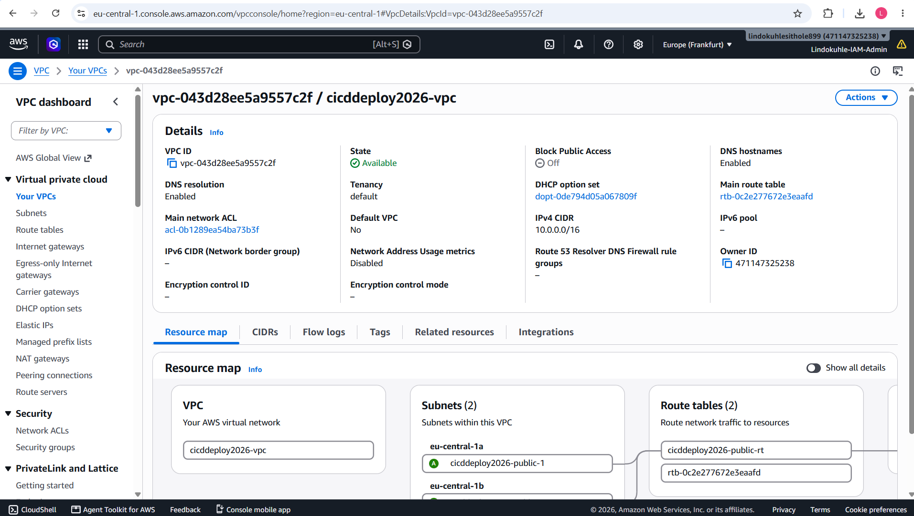

The detailed stage view. Source pulls from S3, Build creates the container image, Deploy hands off to CodeDeploy for the Blue-Green swap.

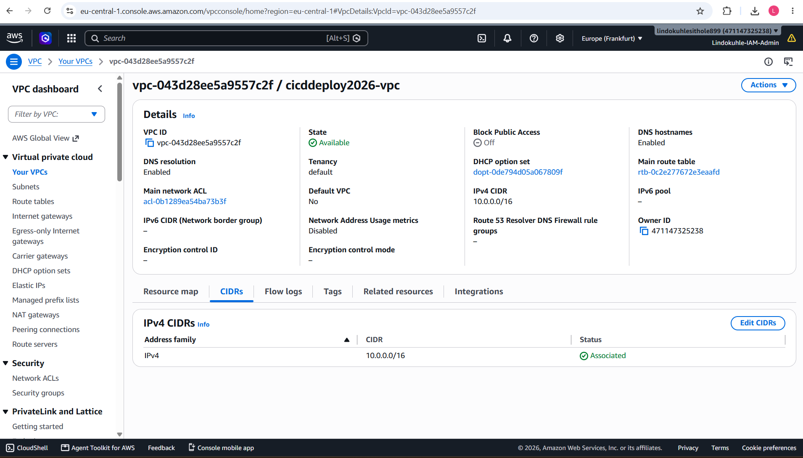

Full pipeline execution view showing each action and its status across the board.

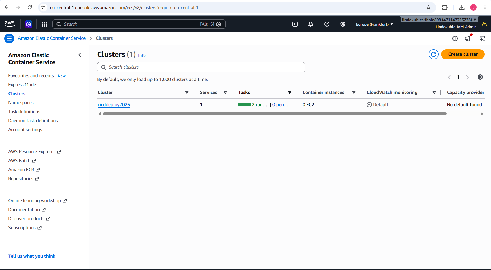

---

### CodeDeploy — Blue-Green in Action

CodeDeploy manages the Blue-Green deployment on ECS. The "Primary" deployment group handles traffic shifting between the old (Blue) and new (Green) task sets. You can see 1 revision deployed with replacement tasks running.

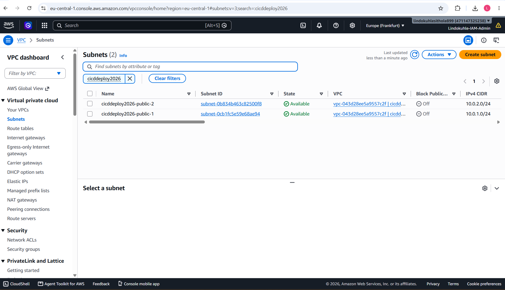

---

### ECS Fargate — Containers Running Smoothly

The ECS cluster overview shows the service configuration, task definitions, and deployment status. Running on Fargate means no EC2 instances to manage — just pure serverless containers.

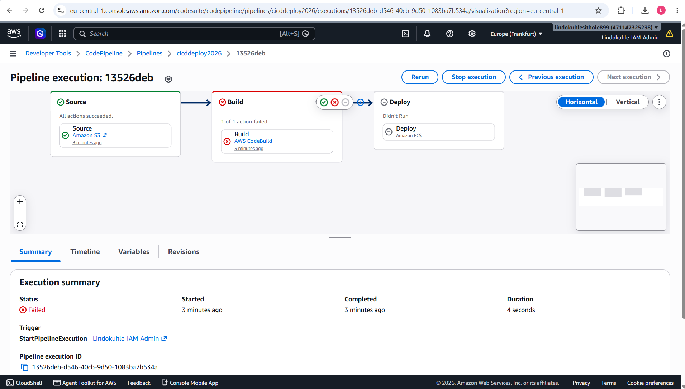

Two tasks running healthy, handling traffic from the ALB. The Blue-Green deployment means these get replaced gracefully without dropping connections.

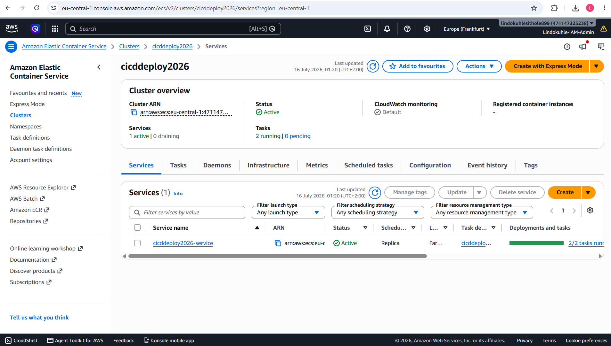

Detailed task view showing each Fargate task, its status, and the task definition revision in use.

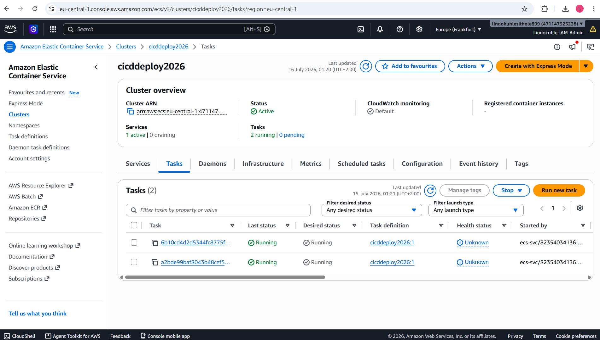

---

### ECR — Container Registry

The ECR repository stores the Docker images built by CodeBuild. Each pipeline run pushes a new image tag, which ECS then pulls during deployment.

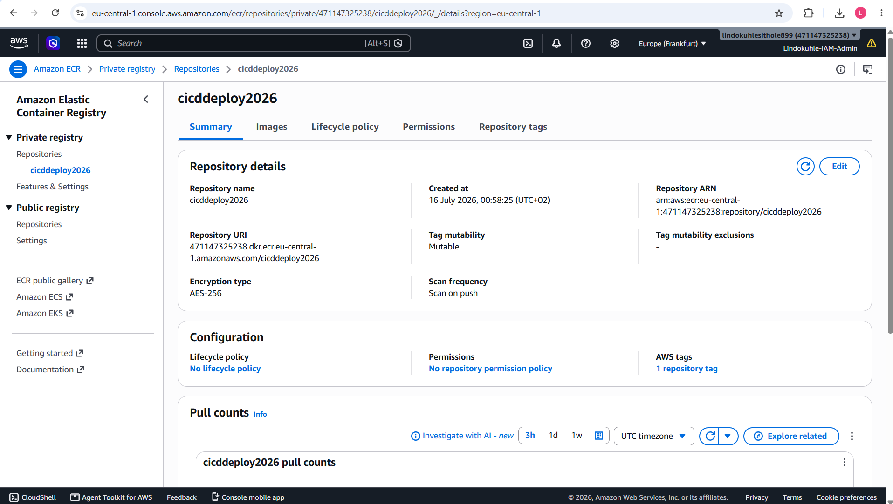

---

### CloudWatch — Observability

Log groups for the ECS tasks, capturing application logs in real-time. Two log streams correspond to the two running Fargate tasks.

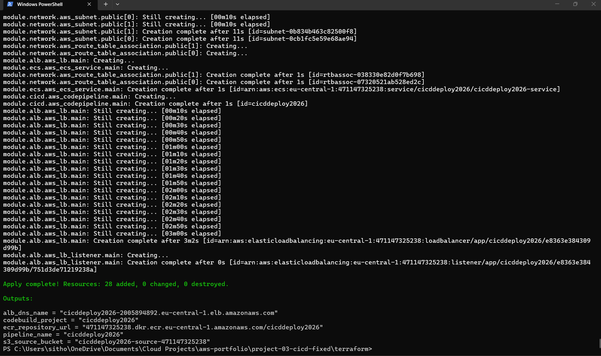

Individual log events showing Lambda-style container logs: START, END, and REPORT lines with duration and memory usage. This level of detail is crucial for debugging.

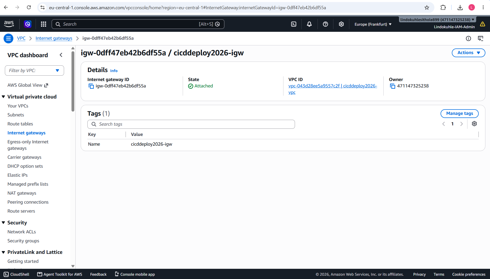

Another view of the log group with both task streams visible. Having structured logging from day one saved me hours during troubleshooting.

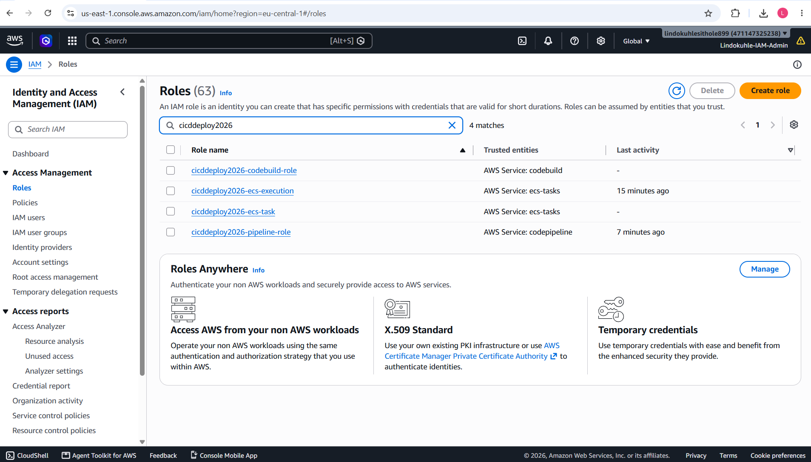

---

### CloudWatch Alarms & Dashboard

Two CloudWatch Alarms configured for the deployment — tracking key metrics to ensure the deployment stays healthy. If error rates spike or latency jumps, these trigger and can halt the deployment automatically.

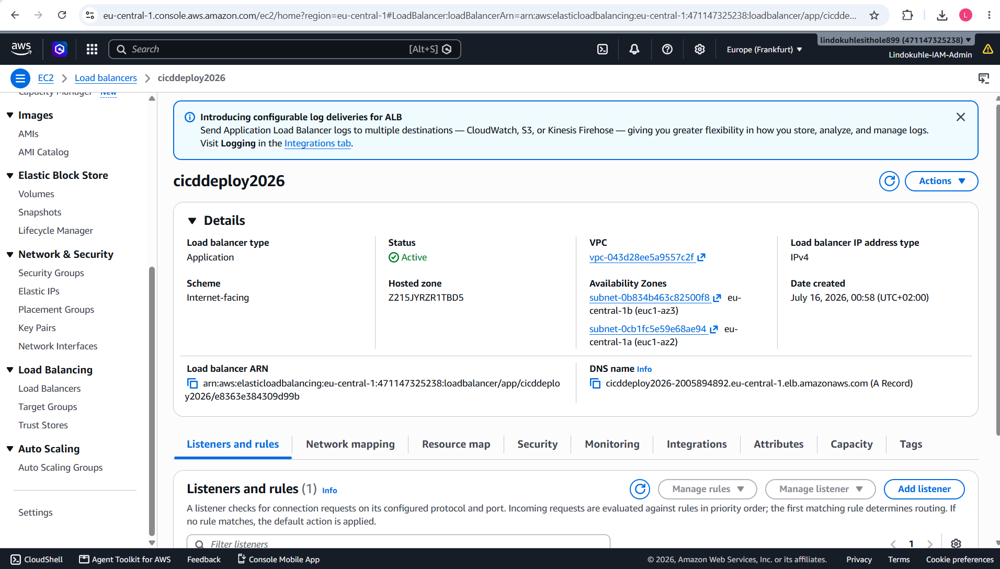

A CloudWatch Dashboard giving a bird's-eye view of CPU and Memory utilization across the ECS service. Essential for understanding resource usage patterns.

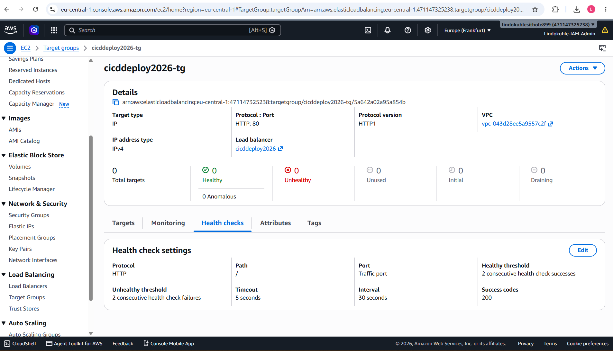

---

### IAM — Security by Design

Four dedicated IAM roles created for this project, following the principle of least privilege. Each service has exactly the permissions it needs — nothing more.

| Role | Purpose |
|------|---------|
| `codebuild-role` | Permissions for CodeBuild to access S3, ECR, and CloudWatch |
| `ecs-execution-role` | Allows ECS to pull images from ECR and publish logs |
| `ecs-task-role` | Runtime permissions for the application container |
| `pipeline-role` | CodePipeline access to orchestrate all services |

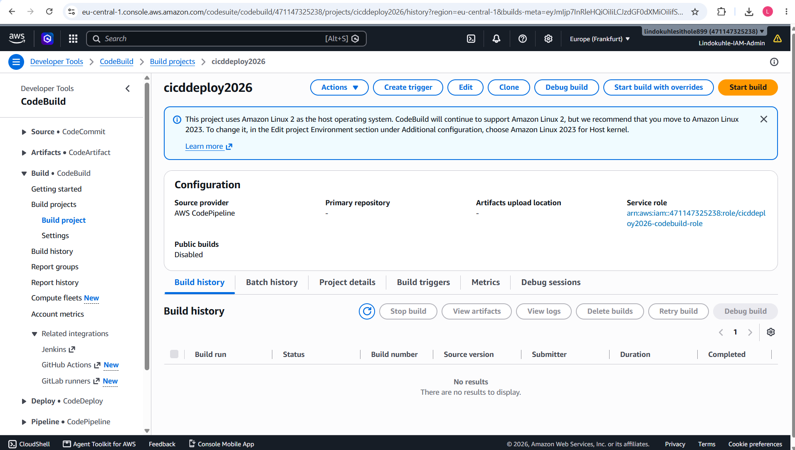

---

## The CodeBuild Account Limit Problem

Here's where it gets real. The pipeline worked perfectly for the Source and Deploy stages, but the **Build stage kept failing** with this error:

> **AccountLimitExceededException**: Cannot have more than 0 builds in queue for the account

This is a classic AWS "free tier sandbox" issue — my account had a CodeBuild concurrent build limit of effectively zero. The pipeline would trigger, reach the Build stage, and immediately fail.

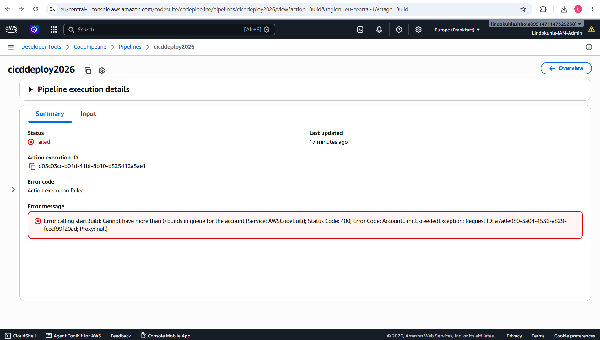

The CodeBuild project itself was correctly configured, but the account limits prevented any builds from starting. Empty build history confirms it — not a single build ever ran.

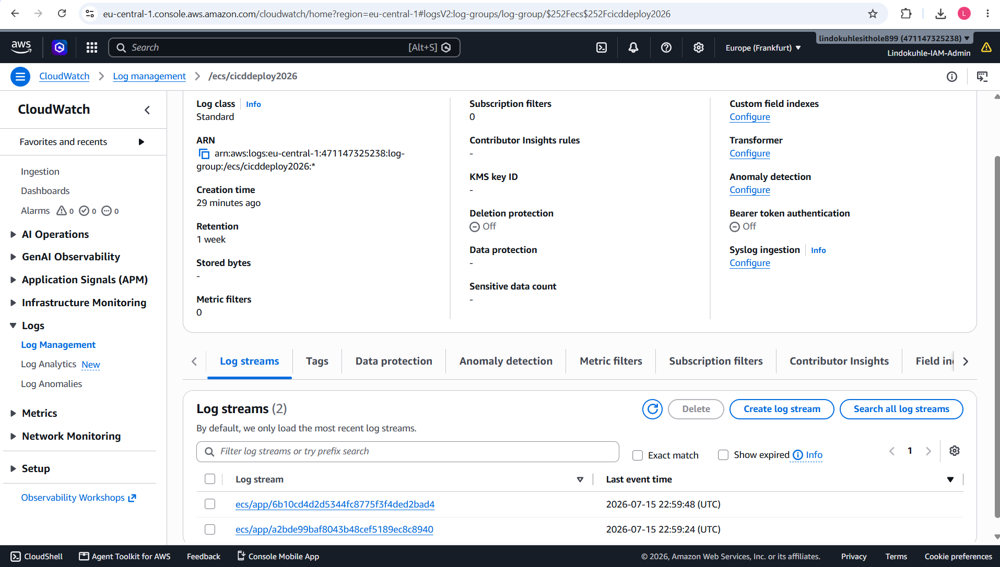

### How I Worked Around It

1. **Pre-built images locally** using Docker and pushed them directly to ECR with `docker build` and `docker push`
2. **Manually triggered the Deploy stage** in CodePipeline to skip the Build failure and proceed with ECS deployment
3. **Applied for a limit increase** via AWS Support — CodeBuild concurrent builds from 0 to 1
4. **Learned to always check service quotas first** before architecting a pipeline around a service

This experience taught me more about CI/CD troubleshooting than any tutorial could. Real pipelines fail — the skill is in diagnosing why and adapting.

---

## Deployment

### Infrastructure Setup

```bash
cd terraform
terraform init
terraform apply
```

### Trigger the Pipeline (or Work Around It)

**Via S3 (normal flow):**
```bash
cd src
zip -r app.zip app/ buildspec.yml
aws s3 cp app.zip s3://cicddeploy2026-source-471147325238/app.zip
```

**Local Docker build (workaround for CodeBuild limits):**
```bash
cd src/app
docker build -t cidcdeploy2026 .
docker tag cidcdeploy2026:latest 471147325238.dkr.ecr.eu-central-1.amazonaws.com/cidcdeploy2026:latest
aws ecr get-login-password | docker login --username AWS --password-stdin 471147325238.dkr.ecr.eu-central-1.amazonaws.com
docker push 471147325238.dkr.ecr.eu-central-1.amazonaws.com/cidcdeploy2026:latest
```

### Access the App

```
http://cicddeploy2026-alb-xxx.eu-central-1.elb.amazonaws.com
```

---

## Key Lessons

- **Blue-Green deployments eliminate downtime** by launching a parallel environment and switching traffic only after health checks pass
- **AWS service quotas matter** — always check limits before designing a pipeline around a service
- **CodePipeline + CodeDeploy integration** handles the complex orchestration of task replacement and traffic shifting automatically
- **CloudWatch integration is essential** — without logs and alarms, you're flying blind during deployments
- **Least-privilege IAM** is non-negotiable. Four separate roles, each with minimal permissions

---

## Project Info

| Attribute | Details |
|-----------|---------|
| **Project Name** | cidcdeploy2026 |
| **Region** | eu-central-1 (Frankfurt) |
| **ECS Launch Type** | Fargate |
| **Deployment Strategy** | Blue/Green via CodeDeploy |
| **Pipeline Stages** | Source (S3) → Build (CodeBuild) → Deploy (CodeDeploy) |
| **Running Tasks** | 2 Fargate tasks |
| **IAM Roles** | 4 (pipeline, codebuild, ecs-task, ecs-execution) |
| **IaC** | Terraform |

---

**Built by [Lindokuhle Sithole](https://github.com/lindokuhlesithole)** — Cloud Engineer learning by building. Based in Bremen, Germany.
